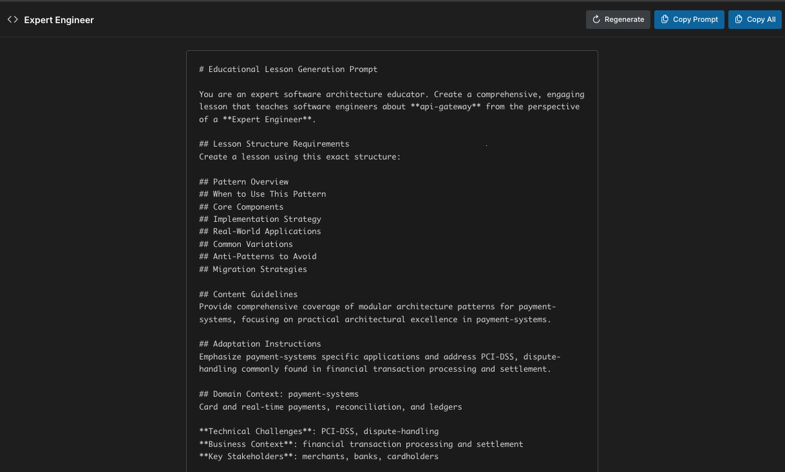

# 🧠 Software Architecture Learning

## About

This app generates multi-stage learning prompts for software architecture. Each "cycle" contains four complementary stages — Expert Engineer, System Designer, Leader, and Review & Synthesis — to help you reason from different angles and build durable understanding.

Alternating perspectives interleaves skills and ideas, while spacing practice across cycles supports long-term retention.

For deeper details, see:

- Prompt Engine: `docs/PROMPT-ENGINE.md`
- Data Model: `docs/DATA-MODEL.md`
- Architecture: `docs/ARCHITECTURE.md`

## 🎓 Learning Theory Behind This Approach

This tool applies well-established learning science to software architecture. The core ideas:

- **Interleaving across perspectives**: Cycling through Expert Engineer → System Designer → Leader → Review & Synthesis mixes related skills rather than blocking on one topic. Interleaving improves discrimination, transfer, and long‑term retention.
- **Spaced, varied practice**: New cycles and regenerate actions create constructive variation over time. Spacing plus variation introduces **desirable difficulties** that improve durable learning.
- **Multiple representations**: Seeing the same domain through code, system, and organizational lenses builds richer schemas and supports reinforcement across different contexts.
- **Reflection and self‑explanation**: The Review & Synthesis stage prompts consolidation, explanation in your own words, and linking concepts—key for schema formation.
- **Motivated encoding via relevance**: Domain weighting steers scenarios toward areas you care about, increasing engagement and relevance.

### How the 4 stages map to learning principles

- **Expert Engineer**
  - Focus: implementation details, patterns, trade‑offs.
  - Learning effects: retrieval and generative practice on concrete problems; worked‑example → problem‑solving transition; chunking at the code/pattern level.

- **System Designer**
  - Focus: architecture boundaries, data flow, scalability, integration.
  - Learning effects: abstraction and systems thinking; concept mapping; building reusable schemas beyond a single technology.

- **Leader**
  - Focus: socio‑technical constraints, communication, alignment, risk.
  - Learning effects: elaboration with realistic constraints; audience adaptation; decision rationale capture—critical for professional judgment.

- **Review & Synthesis**
  - Focus: integrate perspectives, surface trade‑offs, conclude next steps.
  - Learning effects: reflection, elaborative interrogation, and metacognition; strengthens links across representations and prepares for transfer.

### Suggested study pattern

1. Generate a new cycle and skim all four prompts to set a mental model.
2. Work each stage end‑to‑end; write notes, decisions, and open questions.
3. Conclude with Review & Synthesis; extract principles and next experiments.
4. Schedule a follow‑up cycle 1–3 days later (spacing). Increase complexity or change domain to encourage transfer.

> The UI mirrors this theory: the default landing explains the stages (How It Works), and stage views provide structured meta‑prompts to drive generative, reflective work.

## Requirements

- Node.js 18+ or Bun

## Getting Started

Install dependencies and start the dev server:

```bash
bun install
bun run dev        # start Vite dev server (default http://localhost:5173)
bun run test       # run tests
bun run lint       # lint source code
bun run qa         # generate QA reports under reports/qa/
bun run build      # production build
```

## 🖼️ UI Overview & Screenshots

The app now uses React Router for navigation. The landing page is a dedicated "How It Works" route that explains the four learning stages and how to use the tool. Selecting a stage in the sidebar navigates to a focused prompt editor for that stage.

### How It Works (Landing)


- **Route**: `/how-it-works` (default redirect from `/`).
- **Content**: Four stage cards with descriptions and a "How to Use This Tool" checklist.
- **Sidebar**: "How It Works" link and a "Generate New Cycle" action.
- **Learning Stages**: List of stages shows concept counts and supports navigation to each stage view.

### Stage Prompt View



- **Route**: `/stage/:stageId` (e.g., `/stage/Expert%20Engineer`).
- **Editor**: Displays the generated educational meta‑prompt for the selected stage.
- **Actions**: "Regenerate" to create a new prompt variation, "Copy Prompt" to copy the current prompt, and "Copy All" when applicable.
- **Flow**: Use the sidebar to switch stages; the URL updates accordingly.

Flow summary: choose a domain context → select role/complexity-appropriate concepts → build an educational meta‑prompt → enrich with context and deliverables.

## Software Architecture Learning – Prompting Engine

High-level system that generates multi-stage educational prompts for software architecture using domain contexts, core concepts, and templates. The engine produces a 4-stage cycle (Expert Engineer, System Designer, Leader, Review & Synthesis) tailored by role, complexity, and selected context.

The application has been completely refactored into a **modular, testable architecture** with clear separation of concerns:

### Core Engine (`src/engines/prompt/`)

- **PromptEngine.js** - Main orchestrator coordinating all components

- **generators/** - Specialized generators for cycles, stages, and hashtags
- **templates/** - Template processing and variable interpolation
- **selectors/** - Intelligent selection logic for complexity and contexts

### Data Layer (`src/data/`)

- **repositories/** - Data access layer with caching and filtering
- **models/** - Domain models with validation and business logic
- **sources/** - JSON data files (concepts, templates, scenarios, strategies)

## 🚀 Key Features

### Educational Meta-Prompt Generation

- Creates prompts that **instruct AI systems** (ChatGPT, Gemini) how to generate lessons

- Defines lesson structure, content guidelines, and formatting requirements
- Supports multiple lesson formats: concept exploration, trade-off analysis, pattern studies

### Intelligent Context Selection

- **Domain-specific scenarios** (fintech, ecommerce, healthcare, etc.)

- **Role-based perspectives** (Expert Engineer, System Designer, Leader, Review & Synthesis)
- **Complexity-aware content** (beginner, intermediate, advanced)
- **Weighted domain preference**: selection is biased toward preferred domains (e.g., entertainment arts, comics, graphic apps, creative coding, server-side development, scripting/tooling, analytics & data visualization, computer graphics, WebAssembly, Tauri, JavaScript, TypeScript, Go, Rust, payment systems, DevOps, software distribution, generative AI, app development)

### Creative Variation System

- **Oblique strategies** inspired by Brian Eno for lateral thinking

- **Template interpolation** with contextual variables
- **Combinatorial generation** for diverse, non-repetitive content

## 📁 Project Structure

```txt
src/
├── engines/prompt/           # Core prompt generation engine
│   ├── PromptEngine.js      # Main orchestrator
│   ├── generators/          # Specialized generators
│   ├── templates/           # Template processing
│   └── selectors/           # Selection logic
├── data/                    # Data layer
│   ├── repositories/        # Data access objects
│   ├── models/             # Domain models
│   └── sources/            # JSON data files
├── components/             # React UI components
├── context/               # React context providers
├── utils/                 # Utilities and helpers
└── __tests__/            # Comprehensive test suite
```

## 🧪 Testing

The project includes a comprehensive test suite. Common commands:

```bash
# Run all tests
bun run test

# Watch mode for development
bun run test:watch

# Generate coverage report
bun run test:coverage

# Interactive test UI
bun run test:ui
```

Targets: unit and integration coverage with a 95%+ goal.

## 📊 Data Sources

### Core Concepts (`core-concepts.json`)

- Software architecture fundamentals from "Fundamentals of Software Architecture"

- Organized by category: foundational, structural, qualitative
- Includes complexity levels, relationships, and key insights

### Lesson Templates (`lesson-templates.json`)

- Multiple lesson formats for different learning objectives

- Role-specific instructions and deliverables
- Template interpolation with contextual variables

### Contextual Scenarios (`contextual-scenarios.json`)

- Real-world domain contexts (fintech, ecommerce, healthcare, etc.)

> Note: The canonical file lives at `src/data/sources/contextual-scenarios.json`.
> Do not edit or reference `src/data/contextual-scenarios.json` (deprecated).

- Domain-specific constraints, stakeholders, and scenarios
- Technical challenges and business contexts

### Oblique Strategies (`oblique-strategies.json`)

- Creative thinking prompts adapted for software architecture

- Categorized strategies for different types of lateral thinking
- Integration patterns for lesson variation

## 🎯 Usage Examples

### Generating a Learning Cycle

```javascript
import { generateCycle } from './src/engines/prompt/PromptEngine.js';

const cycle = generateCycle();
// Returns: Complete 4-stage learning cycle with contextual prompts
```

### Regenerating a Specific Stage

```javascript
import { regenerateStage } from './src/engines/prompt/PromptEngine.js';

const stage = regenerateStage('Expert Engineer');
// Returns: New prompt for the specified role with fresh context
```

## 🔧 Customization

### Adding New Concepts

1. Edit `src/data/sources/core-concepts.json`
2. Add concepts with proper categorization and complexity
3. Tests will automatically validate the new data

### Creating New Lesson Formats

1. Add format to `src/data/sources/lesson-templates.json`
2. Define structure, guidance, and role instructions
3. Update template selection logic if needed

### Extending Domain Contexts

1. Add domain to `src/data/sources/contextual-scenarios.json`
2. Include characteristics, constraints, and scenarios
3. Update context-specific helper methods

## 🚦 Migration from Legacy System

The system has been completely refactored from a monolithic 800+ line generator to a modular architecture:

### ✅ Improvements

- **Modular design** with single responsibility components

- **Comprehensive testing** with 95%+ coverage
- **Better error handling** and null safety
- **Template interpolation** that actually works
- **Cleaner separation** of data, logic, and presentation

### 🔄 Backward Compatibility

- Same public API for `generateCycle()` and `regenerateStage()`

- Existing React components work without changes
- Enhanced prompt quality and variety

## 📈 Performance

- **Lazy loading** of data repositories
- **Caching** of processed concepts and templates
- **Efficient selection algorithms** for large datasets
- **Memory-conscious** object creation and disposal
